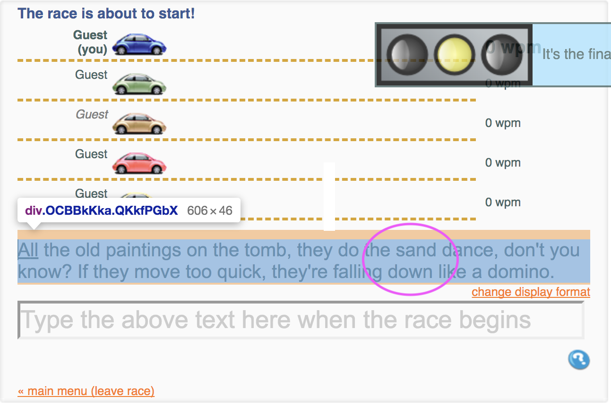
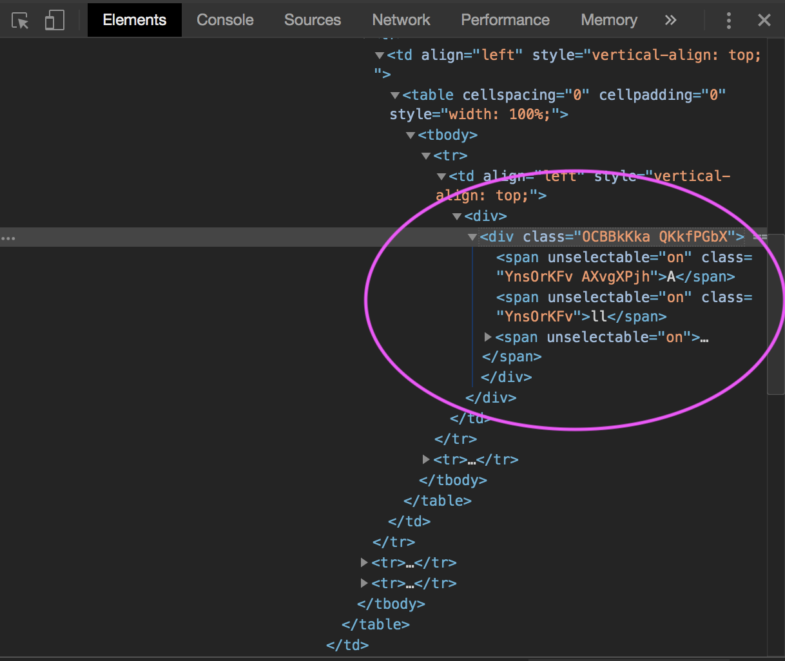
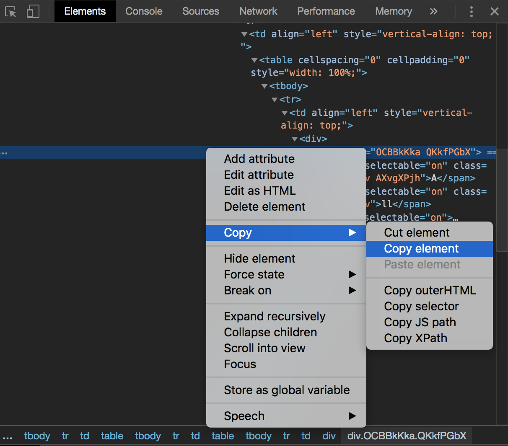
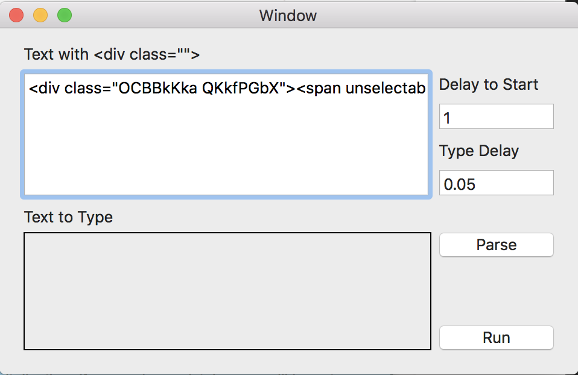
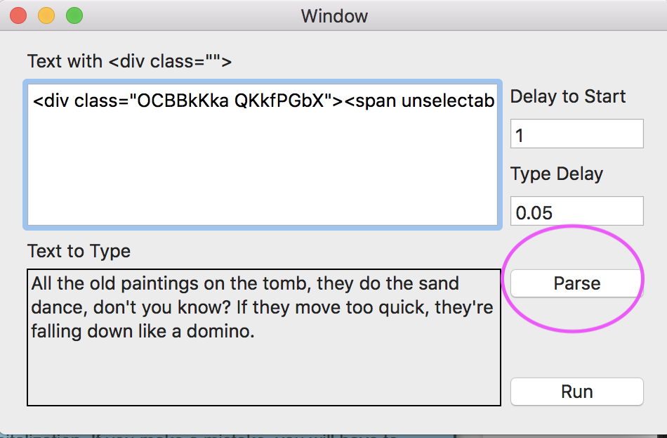
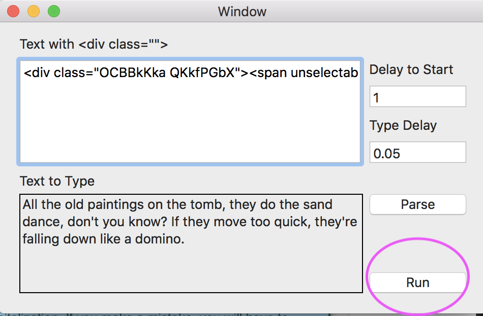
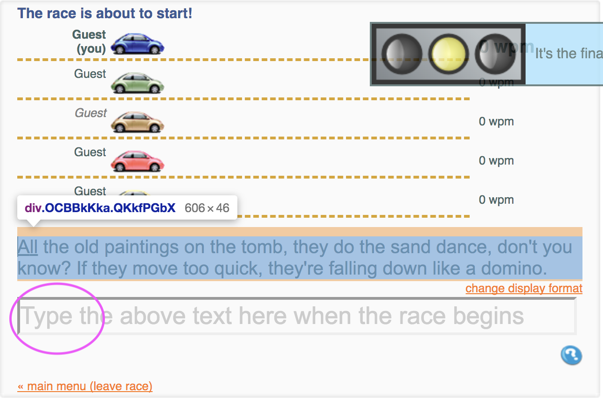

# TypeTypeRevenge

## What is this

`TypeTypeRevenge` is a bot app to simulate typing via keyboard in Mac OS.
It is intended to win the `typeracer(dot)com` challenge.

## Download

[Download here!](https://raw.githubusercontent.com/mabdh/TypeTypeRevenge/master/dist/TypeTypeRevenge.app.zip)

The app is only tested in High Sierra OS, feel free to contact if you have any problem in other OSes.

## How to use
1. After the race has just been started, right click on the text and click `inspect`

2. A new window to inspect an element would appear and select the line with `
...` tag

3. `Cmd+C`on that `
` to copy or right click on that `
...` line, click copy and copy element

4. Go to TypeTypeRevenge app and paste to the edit box (the white box)

5. (Optional) Click parse to make sure the text is correct. `Run` button will also parse it first before it runs.

6. Back to TypeTypeRevenge app and click `Run` button. You have (by default 1 second) `Delay to Start` second before the bot is started

7. Back to the site and place your cursor in the type box and wait to be a winner.

<!-- ## Here is the GIF

-->

@ 2019
[mabdh.com](http://mabdh.github.io)
